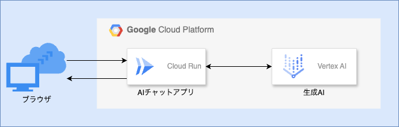

# Sample AI Chat

Gemini 1.5 ProとClaude 3 Opusを並べてチャットをするだけのアプリ

## 使用技術
- VertexAI
- LangChain
- Streamlit
- OAuth(GoogleCloud)

## サービスの設定
- Google Cloud
  - VertexAI APIをオンにする
  - GoogleCloudのOAuth2に同意して、OAuth 2.0 クライアント IDを発行する
    - scopeに`https://www.googleapis.com/auth/cloud-identity.groups.readonly`を追加
  - People APIをオンにする
  - Cloud Identity APIをオンにする

## 環境変数の設定
- `.env.sample`を`.env`にコピー
- 各種環境変数を設定

## ユーザーと特定のGoogleGroupにしぼりたい時
- `GOOGLE_GROUP_ID`に対象のGoogleGroupのIDを入れてください。
  - このIDはメールアドレスではありません。
  - 以下のコマンドで確認できる`group/{'group_id'}`です。(/の後ろの部分)
    - `gcloud identity groups describe (メールアドレス) --project=(GoogleCloudのプロジェクトID)`

## 起動方法

### ローカルPC

#### 準備

- ryeのインストール(パッケージ管理ツール)

```
curl -sSf https://rye-up.com/get | bash
```

#### パッケージインストール

```
rye sync
```

#### アプリ起動

```
rye run start
```

### docker

#### ビルド

```
docker compose build
```

#### 起動

```
docker compose up
```

## ホスティング(CloudRunの場合)

### 構成図



### CloudRunへの構築メモ

- CloudRun APIをONにする
- Secret Manager APIをONにする
- IAM APIをONにする
- CloudRun用のサービスアカウントを作成する
  - 必要なロールは以下
    - Secret Managerのアクセサー
    - Vertex AI ユーザー
- Secret ManagerにGoogle OAuth2のシークレットを保存
- Cloud Runの作成
  - GitHubのレポジトリから自動でデプロイする設定にする
    - CloudBuildでdockerfileからビルドするように設定する
  - Ingressはすべて許可
  - 環境変数に上記のシークレット + その他必要な変数を設定する
    - リダイレクトURIは、作成前には分からないので後から入れる
  - コンテナポートは8501
  - メモリは4GiB以上を推奨。CPUは1以上を推奨。
  - セキュリティタブからサービスアカウントを設定
- リダイレクトURIの設定
  - 以下にCloudRunのURLを設定
    - OAuth 2.0 クライアントの承認済みURI
    - CloudRunの環境変数
